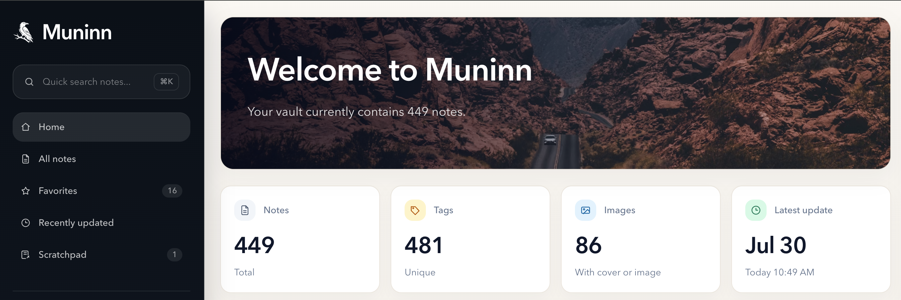
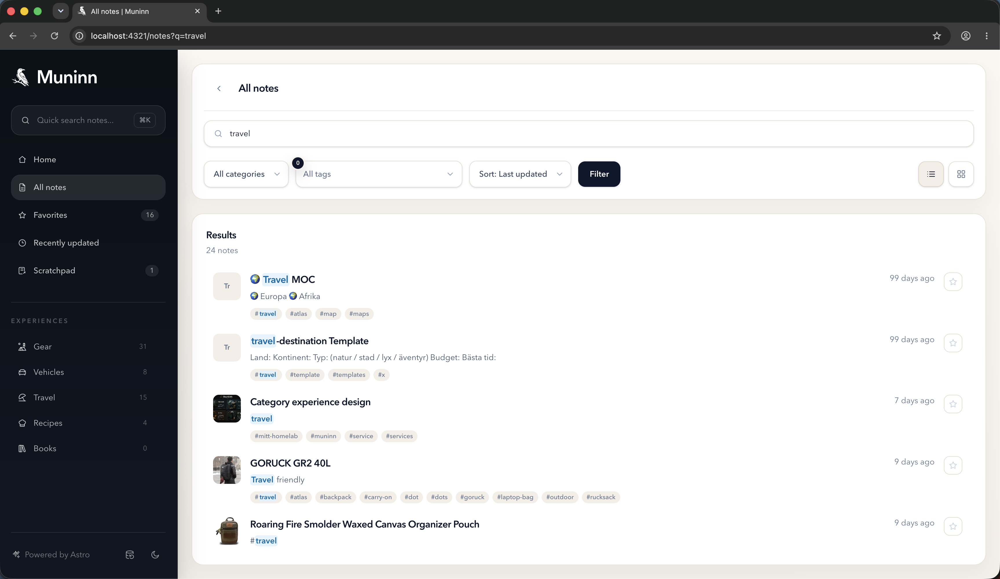
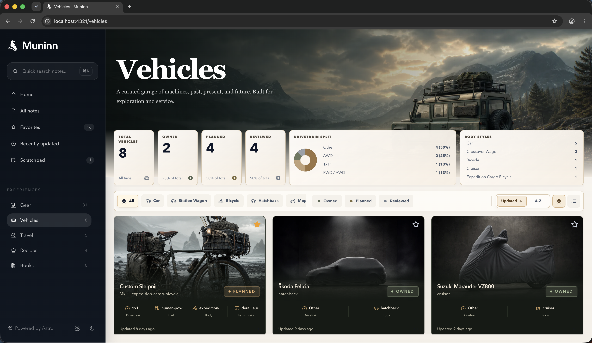

# Muninn

Muninn is an Astro-based, read-only interface for an Obsidian vault. It combines a searchable Library with focused, data-rich Experiences that surface useful information from your notes. Outside Docker, Muninn reads the vault location from `VAULT_PATH`; inside Docker, the vault is always mounted at `/vault`.

<p align="center">
  
</p>

Important:

- The Obsidian vault is read-only from Muninn's perspective.
- Muninn reads notes and assets from the vault, but does not write anything back into it.
- `Anteckningsblock` is app-owned data stored separately from the vault.
- `Anteckningsblock` is never written to the Obsidian vault.

## Local Development

Local development remains unchanged:

```sh
npm install
cp .env.example .env
npm run dev
```

Use the committed example vault by default:

```env
VAULT_PATH=./data/example-vault
```

If you want to test against a private local vault instead:

```env
VAULT_PATH=./data/vault
```

## Docker

Create a real `.env` for your deployment environment:

```env
VAULT_HOST_PATH=/your/vault
STATE_HOST_PATH=/your/state
```

Then start the container:

```sh
docker compose up
```

Inside the container, Muninn reads the vault from:

```env
VAULT_PATH=/vault
```

That internal path is fixed by `docker-compose.yml`. Only the host-side mount values differ between Windows, macOS, Linux, Synology, TrueNAS, Unraid, Portainer overrides, or other deployment platforms.

The production container runs as UID/GID `1000:1000`. The vault must be readable by that user and the state directory must be writable. Application logs are written to the container's standard output and can be read through Docker or Portainer.

The image is an Astro Node standalone server, not a static nginx image. Muninn needs Node at runtime for server-rendered routes, vault traversal, dynamic vault assets, favorites, scratchpad state, and the Reload Vault API. Server dependencies are bundled into the build output, so the final image contains only `dist/` on top of the Node runtime; source files, `node_modules`, and build tooling stay in the builder stage.

## Notes

- `data/vault/` is treated as local ignored data.
- `data/example-vault/` is committed so the app can run without a private vault.
- The Obsidian vault is treated as a read-only content source.
- `Anteckningsblock` belongs to Muninn, not to Obsidian.
- Local app-owned state lives in `data/local-state/`.
- In Docker, app-owned state lives in `/state/`.
- Scratchpad notes are not synced or written back to the vault.
- `public/vault-assets/` is generated during `predev` and `prebuild`.
- Vault content is never copied into the production image. `/vault-assets/*` is served from the runtime `/vault` mount.
- `.env` is local-only and should never be committed.

## Commands

- `npm run dev` starts the local Astro dev server.
- `npm run build` builds the production server output.
- `npm run start` runs the built Astro Node standalone server.
- `npm run preview` previews the built app locally.
- `npm run update-os-icons` downloads the curated OS SVG sources, optimizes them with SVGO, and regenerates the local offline OS asset registry. Read more: `docs/os-asset-registry`

## Screenshots

### Library browser

The Library browser provides a fast way to search, filter, and sort every note in your vault. Results combine relevant excerpts, metadata, and tags so you can quickly identify the note you are looking for.

<p align="center">
  
</p>

_Search results in the Library browser._

> Matching words and tags are highlighted using familiar search semantics inspired by Obsidian and VS Code.

### Experience browser

Experiences turn selected groups of notes into focused, themed browsing surfaces. Each Experience can combine its own artwork, statistics, filters, card design, and inspector while the underlying Markdown notes remain the source of truth.

<p align="center">
  
</p>

_The Vehicles Experience demonstrates how Muninn can derive useful statistics and card details from both structured frontmatter and information found within notes. Important specifications become immediately visible while the complete notes remain available through the inspector and standard note reader._
